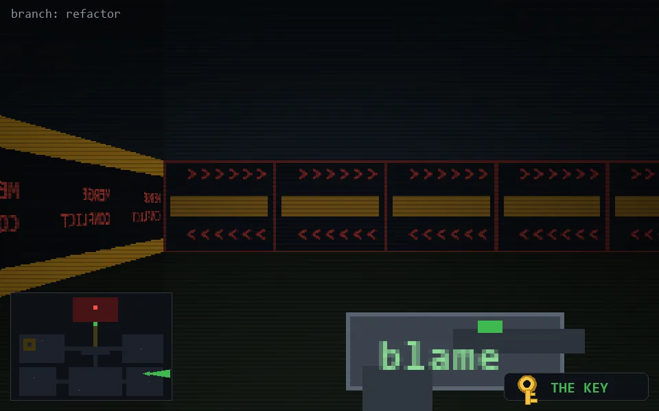

<!-- node:x32y19Ek -->
### `branch: refactor` · 📍 (32, 19) · facing E · 🔑 THE KEY

|      |      |      |
|:----:|:----:|:----:|
|      | [⬆️](x33y19Ek.md) |      |
| [⬅️](x32y19Nk.md) | [💥](x32y19Ekd.md) | [➡️](x32y19Sk.md) |
|      | [⬇️](x31y19Ek.md) |      |

[⌂ index](../README.md)
