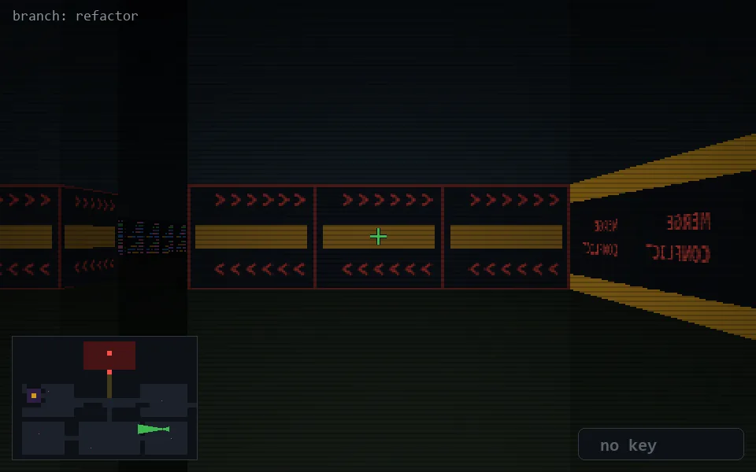

<!-- node:x32y19Wd -->
### `branch: refactor` · 📍 (32, 19) · facing W · 🔑 — · ✖ bug deleted (it will be back)

|      |      |      |
|:----:|:----:|:----:|
|      | [⬆️](x31y19Wd.md) |      |
| [⬅️](x32y19Sd.md) | [💥](x32y19Wd.md) | [➡️](x32y19Nd.md) |
|      | [⬇️](x33y19Wd.md) |      |

[⌂ index](../README.md)
