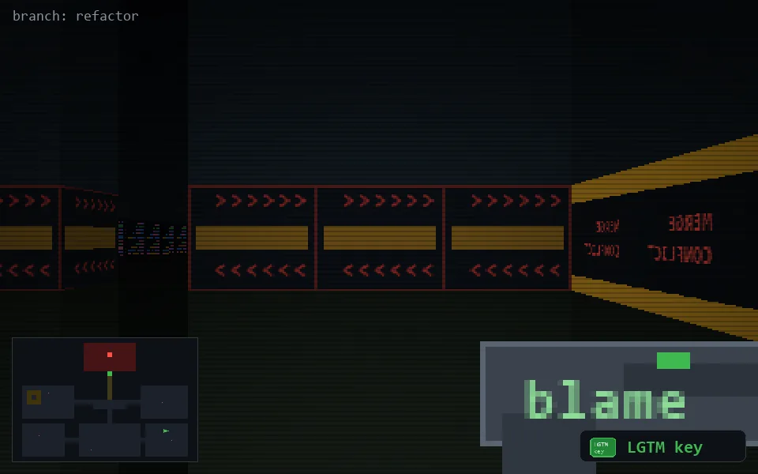

<!-- node:x32y19Wk -->
### `branch: refactor` · 📍 (32, 19) · facing W · 🔑 LGTM

|      |      |      |
|:----:|:----:|:----:|
|      | [⬆️](x31y19Wk.md) |      |
| [⬅️](x32y19Sk.md) | [💥](x32y19Wk.md) | [➡️](x32y19Nk.md) |
|      | [⬇️](x33y19Wk.md) |      |

[⌂ index](../README.md)
