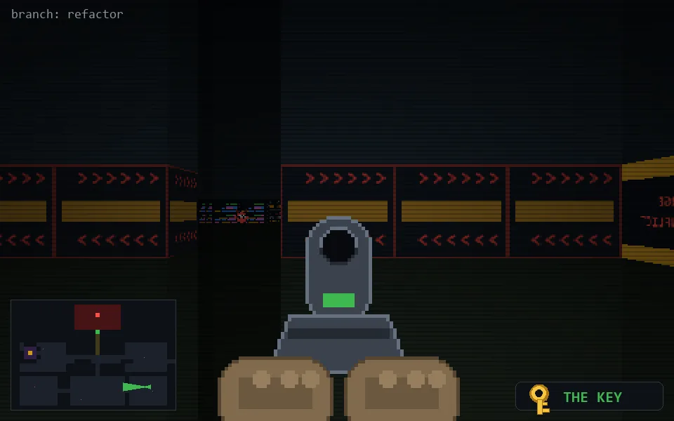

<!-- node:x32y20Wkd -->
### `branch: refactor` · 📍 (32, 20) · facing W · 🔑 THE KEY · ✖ bug deleted (it will be back)

|      |      |      |
|:----:|:----:|:----:|
|      | [⬆️](x31y20Wkd.md) |      |
| [⬅️](x32y20Skd.md) | [💥](x32y20Wkd.md) | [➡️](x32y20Nkd.md) |
|      | [⬇️](x33y20Wkd.md) |      |

[⌂ index](../README.md)
