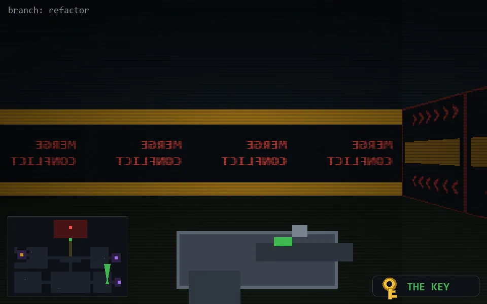

<!-- node:x32y21Nk -->
### `branch: refactor` · 📍 (32, 21) · facing N · 🔑 LGTM

|      |      |      |
|:----:|:----:|:----:|
|      | [⬆️](x32y20Nk.md) |      |
| [⬅️](x32y21Wk.md) | [💥](x32y21Nk.md) | [➡️](x32y21Ek.md) |
|      | [⬇️](x32y22Nk.md) |      |

[⌂ index](../README.md)
