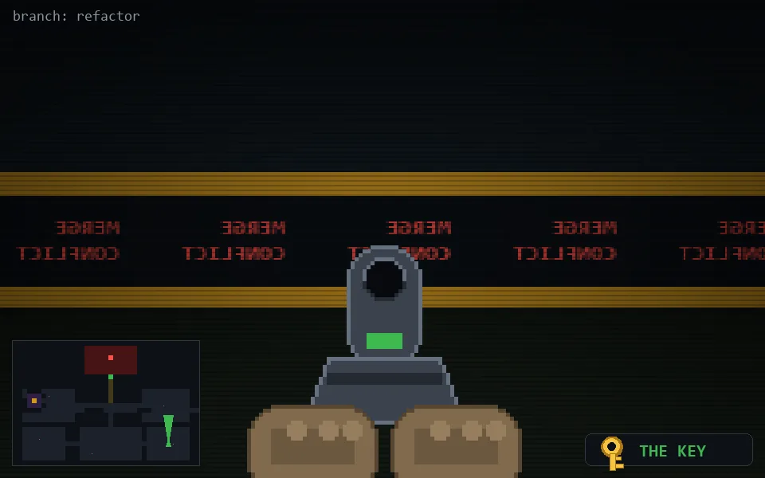

<!-- node:x32y21Nkd -->
### `branch: refactor` · 📍 (32, 21) · facing N · 🔑 THE KEY · ✖ bug deleted (it will be back)

|      |      |      |
|:----:|:----:|:----:|
|      | [⬆️](x32y20Nkd.md) |      |
| [⬅️](x32y21Wkd.md) | [💥](x32y21Nkd.md) | [➡️](x32y21Ekd.md) |
|      | [⬇️](x32y22Nkd.md) |      |

[⌂ index](../README.md)
