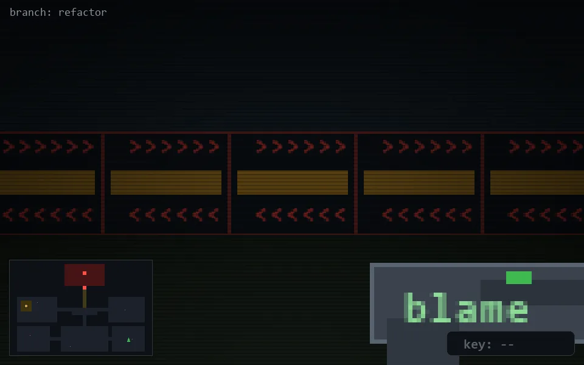

<!-- node:x32y21S -->
### `branch: refactor` · 📍 (32, 21) · facing S · 🔑 —

|      |      |      |
|:----:|:----:|:----:|
|      | [⬆️](x32y22S.md) |      |
| [⬅️](x32y21E.md) | [💥](x32y21Sd.md) | [➡️](x32y21W.md) |
|      | [⬇️](x32y20S.md) |      |

[⌂ index](../README.md)
