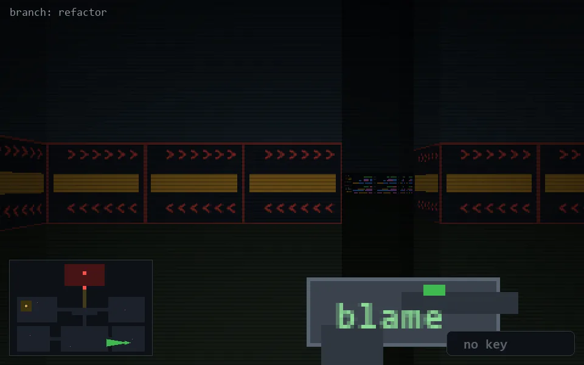

<!-- node:x32y22W -->
### `branch: refactor` · 📍 (32, 22) · facing W · 🔑 —

|      |      |      |
|:----:|:----:|:----:|
|      | [⬆️](x31y22W.md) |      |
| [⬅️](x32y22S.md) | [💥](x32y22W.md) | [➡️](x32y22N.md) |
|      | [⬇️](x33y22W.md) |      |

[⌂ index](../README.md)
