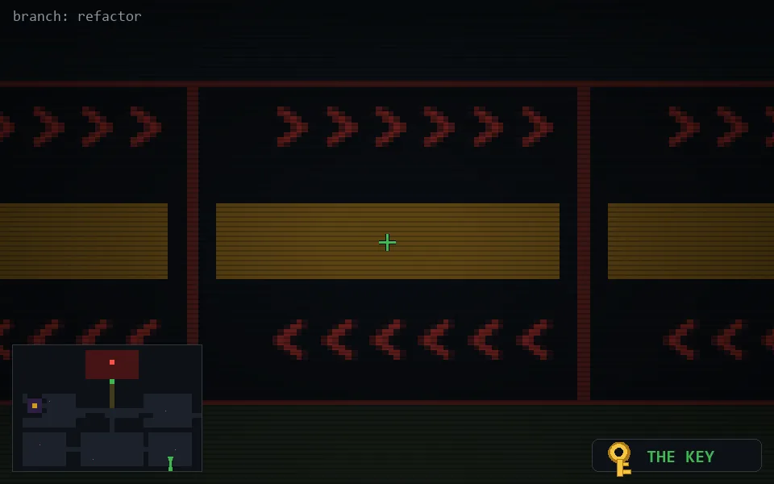

<!-- node:x32y23Sk -->
### `branch: refactor` · 📍 (32, 23) · facing S · 🔑 THE KEY

|      |      |      |
|:----:|:----:|:----:|
|      | [⬆️](x32y24Sk.md) |      |
| [⬅️](x32y23Ek.md) | [💥](x32y23Skd.md) | [➡️](x32y23Wk.md) |
|      | [⬇️](x32y22Sk.md) |      |

[⌂ index](../README.md)
