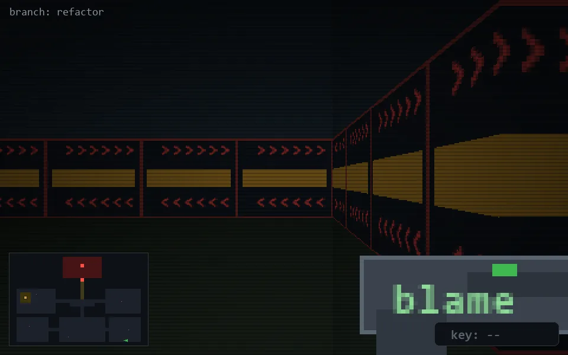

<!-- node:x32y24E -->
### `branch: refactor` · 📍 (32, 24) · facing E · 🔑 —

|      |      |      |
|:----:|:----:|:----:|
|      | [⬆️](x33y24E.md) |      |
| [⬅️](x32y24N.md) | [💥](x32y24Ed.md) | [➡️](x32y24S.md) |
|      | [⬇️](x31y24E.md) |      |

[⌂ index](../README.md)
