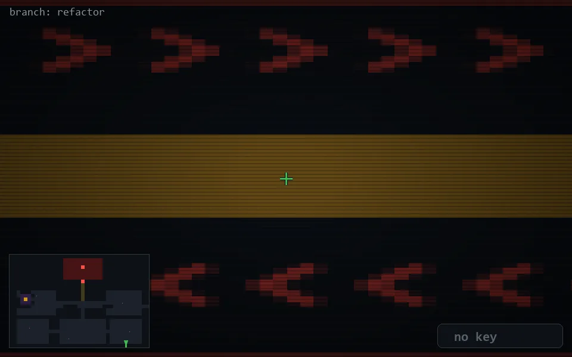

<!-- node:x32y24S -->
### `branch: refactor` · 📍 (32, 24) · facing S · 🔑 —

|      |      |      |
|:----:|:----:|:----:|
|      | ⛔️ |      |
| [⬅️](x32y24E.md) | [💥](x32y24Sd.md) | [➡️](x32y24W.md) |
|      | [⬇️](x32y23S.md) |      |

[⌂ index](../README.md)
