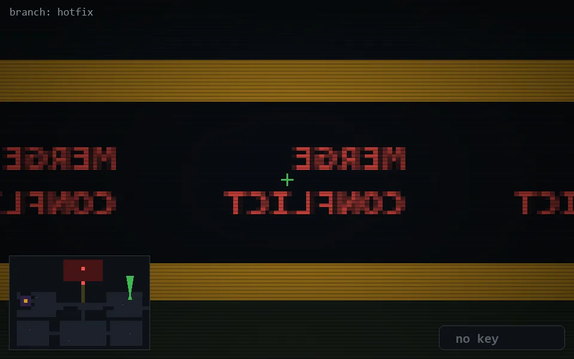

<!-- node:x33y11N -->
### `branch: hotfix` · 📍 (33, 11) · facing N · 🔑 —

|      |      |      |
|:----:|:----:|:----:|
|      | [⬆️](x33y10N.md) |      |
| [⬅️](x33y11W.md) | [💥](x33y11N.md) | [➡️](x33y11E.md) |
|      | [⬇️](x33y12N.md) |      |

[⌂ index](../README.md)
