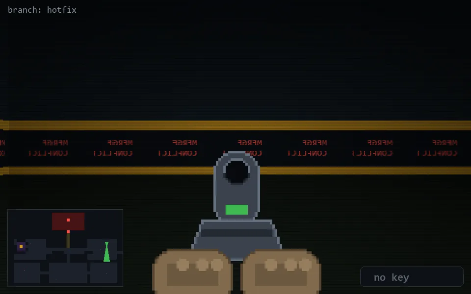

<!-- node:x33y11Sd -->
### `branch: hotfix` · 📍 (33, 11) · facing S · 🔑 — · ✖ bug deleted (it will be back)

|      |      |      |
|:----:|:----:|:----:|
|      | [⬆️](x33y12Sd.md) |      |
| [⬅️](x33y11Ed.md) | [💥](x33y11Sd.md) | [➡️](x33y11Wd.md) |
|      | [⬇️](x33y10Sd.md) |      |

[⌂ index](../README.md)
