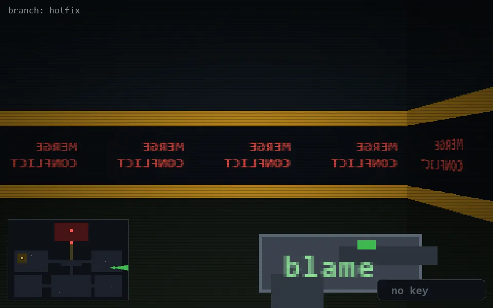

<!-- node:x33y15E -->
### `branch: hotfix` · 📍 (33, 15) · facing E · 🔑 —

|      |      |      |
|:----:|:----:|:----:|
|      | [⬆️](x34y15E.md) |      |
| [⬅️](x33y15N.md) | [💥](x33y15E.md) | [➡️](x33y15S.md) |
|      | [⬇️](x32y15E.md) |      |

[⌂ index](../README.md)
