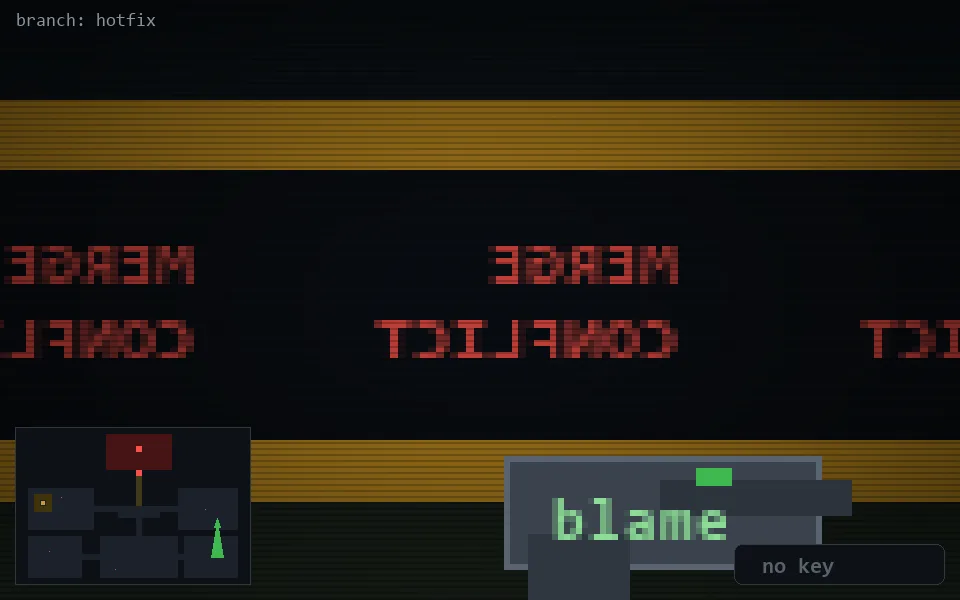

<!-- node:x33y15S -->
### `branch: hotfix` · 📍 (33, 15) · facing S · 🔑 —

|      |      |      |
|:----:|:----:|:----:|
|      | [⬆️](x33y16S.md) |      |
| [⬅️](x33y15E.md) | [💥](x33y15S.md) | [➡️](x33y15W.md) |
|      | [⬇️](x33y14S.md) |      |

[⌂ index](../README.md)
