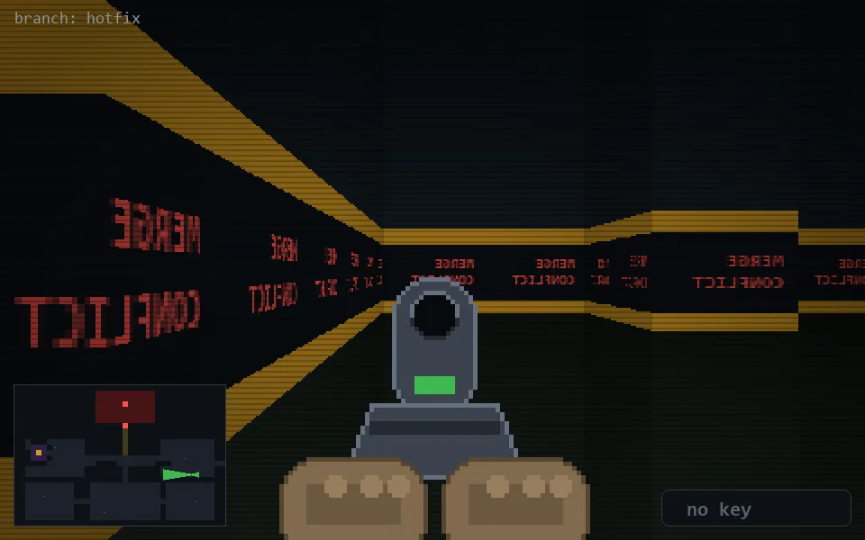

<!-- node:x33y16Wd -->
### `branch: hotfix` · 📍 (33, 16) · facing W · 🔑 — · ✖ bug deleted (it will be back)

|      |      |      |
|:----:|:----:|:----:|
|      | [⬆️](x32y16Wd.md) |      |
| [⬅️](x33y16Sd.md) | [💥](x33y16Wd.md) | [➡️](x33y16Nd.md) |
|      | [⬇️](x34y16Wd.md) |      |

[⌂ index](../README.md)
