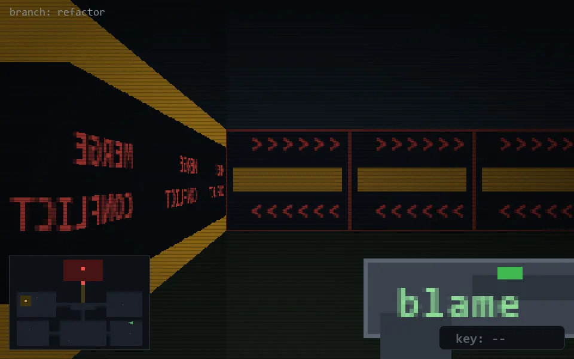

<!-- node:x33y18E -->
### `branch: refactor` · 📍 (33, 18) · facing E · 🔑 —

|      |      |      |
|:----:|:----:|:----:|
|      | ⛔️ |      |
| [⬅️](x33y18N.md) | [💥](x33y18E.md) | [➡️](x33y18S.md) |
|      | [⬇️](x32y18E.md) |      |

[⌂ index](../README.md)
