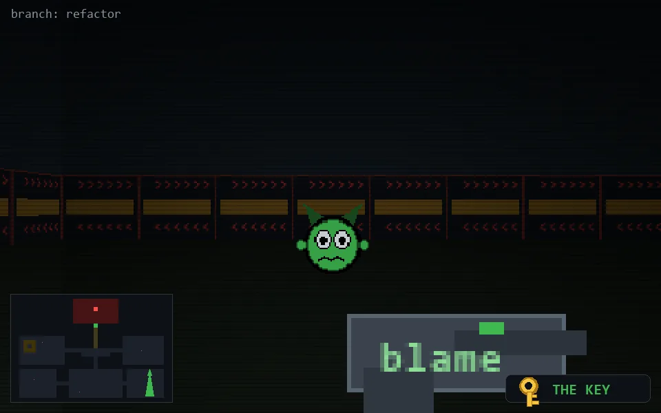

<!-- node:x33y18Sk -->
### `branch: refactor` · 📍 (33, 18) · facing S · 🔑 THE KEY

|      |      |      |
|:----:|:----:|:----:|
|      | [⬆️](x33y19Sk.md) |      |
| [⬅️](x33y18Ek.md) | [💥](x33y18Skd.md) | [➡️](x33y18Wk.md) |
|      | ⛔️ |      |

[⌂ index](../README.md)
