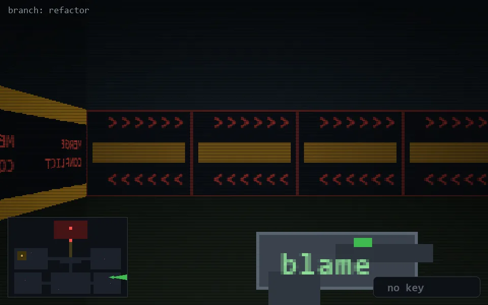

<!-- node:x33y19E -->
### `branch: refactor` · 📍 (33, 19) · facing E · 🔑 —

|      |      |      |
|:----:|:----:|:----:|
|      | [⬆️](x34y19E.md) |      |
| [⬅️](x33y19N.md) | [💥](x33y19E.md) | [➡️](x33y19S.md) |
|      | [⬇️](x32y19E.md) |      |

[⌂ index](../README.md)
