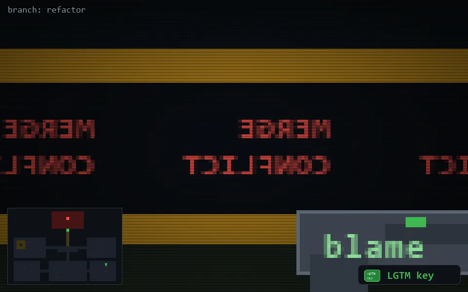

<!-- node:x33y19Nk -->
### `branch: refactor` · 📍 (33, 19) · facing N · 🔑 LGTM

|      |      |      |
|:----:|:----:|:----:|
|      | [⬆️](x33y18Nk.md) |      |
| [⬅️](x33y19Wk.md) | [💥](x33y19Nk.md) | [➡️](x33y19Ek.md) |
|      | [⬇️](x33y20Nk.md) |      |

[⌂ index](../README.md)
