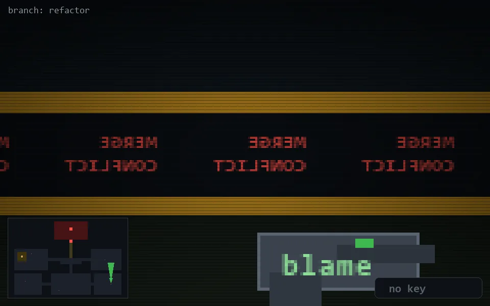

<!-- node:x33y20N -->
### `branch: refactor` · 📍 (33, 20) · facing N · 🔑 —

|      |      |      |
|:----:|:----:|:----:|
|      | [⬆️](x33y19N.md) |      |
| [⬅️](x33y20W.md) | [💥](x33y20N.md) | [➡️](x33y20E.md) |
|      | [⬇️](x33y21N.md) |      |

[⌂ index](../README.md)
