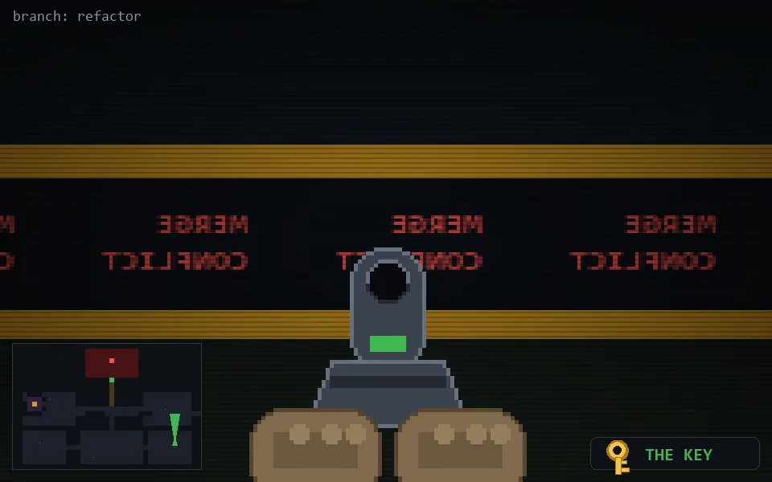

<!-- node:x33y20Nkd -->
### `branch: refactor` · 📍 (33, 20) · facing N · 🔑 THE KEY · ✖ bug deleted (it will be back)

|      |      |      |
|:----:|:----:|:----:|
|      | [⬆️](x33y19Nkd.md) |      |
| [⬅️](x33y20Wkd.md) | [💥](x33y20Nkd.md) | [➡️](x33y20Ekd.md) |
|      | [⬇️](x33y21Nkd.md) |      |

[⌂ index](../README.md)
