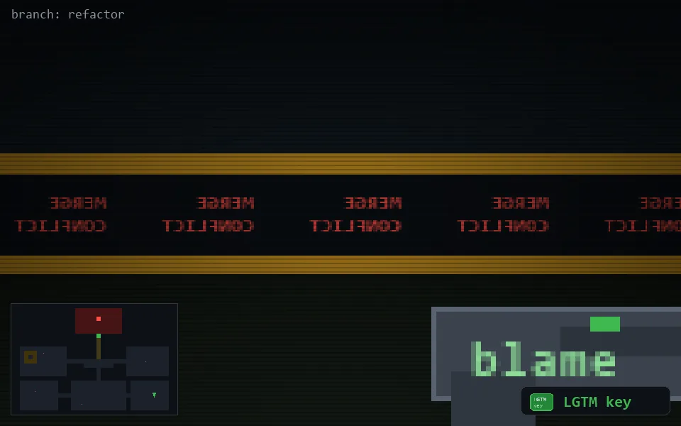

<!-- node:x33y21Nk -->
### `branch: refactor` · 📍 (33, 21) · facing N · 🔑 THE KEY

|      |      |      |
|:----:|:----:|:----:|
|      | [⬆️](x33y20Nk.md) |      |
| [⬅️](x33y21Wk.md) | [💥](x33y21Nk.md) | [➡️](x33y21Ek.md) |
|      | [⬇️](x33y22Nk.md) |      |

[⌂ index](../README.md)
