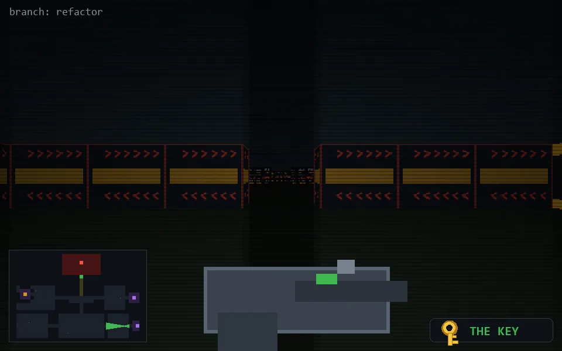

<!-- node:x33y21Wk -->
### `branch: refactor` · 📍 (33, 21) · facing W · 🔑 LGTM

|      |      |      |
|:----:|:----:|:----:|
|      | [⬆️](x32y21Wk.md) |      |
| [⬅️](x33y21Sk.md) | [💥](x33y21Wk.md) | [➡️](x33y21Nk.md) |
|      | [⬇️](x34y21Wk.md) |      |

[⌂ index](../README.md)
