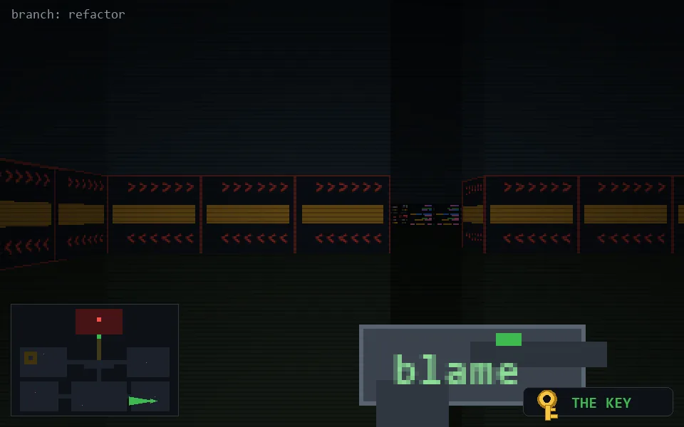

<!-- node:x33y22Wk -->
### `branch: refactor` · 📍 (33, 22) · facing W · 🔑 THE KEY

|      |      |      |
|:----:|:----:|:----:|
|      | [⬆️](x32y22Wk.md) |      |
| [⬅️](x33y22Sk.md) | [💥](x33y22Wk.md) | [➡️](x33y22Nk.md) |
|      | [⬇️](x34y22Wk.md) |      |

[⌂ index](../README.md)
