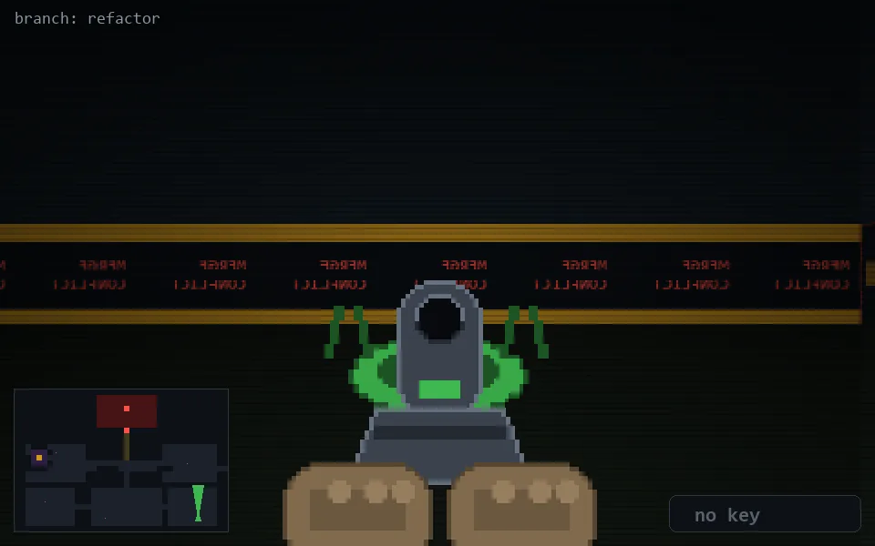

<!-- node:x33y23Nd -->
### `branch: refactor` · 📍 (33, 23) · facing N · 🔑 — · ✖ bug deleted (it will be back)

|      |      |      |
|:----:|:----:|:----:|
|      | [⬆️](x33y22Nd.md) |      |
| [⬅️](x33y23Wd.md) | [💥](x33y23Nd.md) | [➡️](x33y23Ed.md) |
|      | [⬇️](x33y24Nd.md) |      |

[⌂ index](../README.md)
