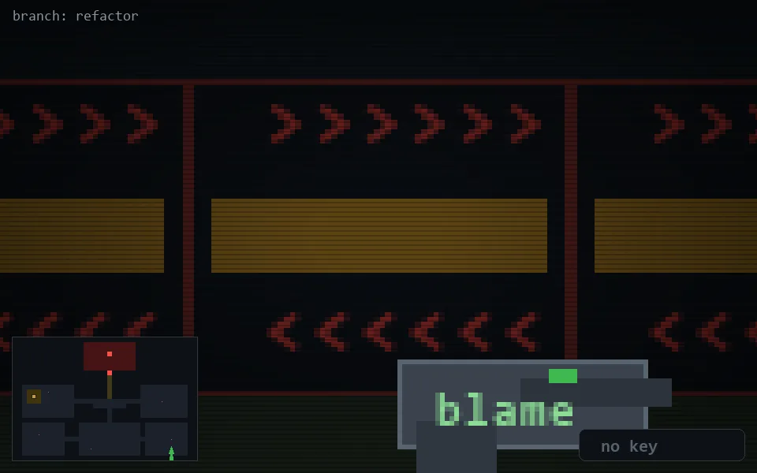

<!-- node:x33y23S -->
### `branch: refactor` · 📍 (33, 23) · facing S · 🔑 —

|      |      |      |
|:----:|:----:|:----:|
|      | [⬆️](x33y24S.md) |      |
| [⬅️](x33y23E.md) | [💥](x33y23Sd.md) | [➡️](x33y23W.md) |
|      | [⬇️](x33y22S.md) |      |

[⌂ index](../README.md)
