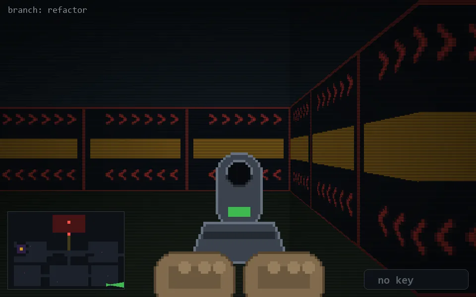

<!-- node:x33y24Ed -->
### `branch: refactor` · 📍 (33, 24) · facing E · 🔑 — · ✖ bug deleted (it will be back)

|      |      |      |
|:----:|:----:|:----:|
|      | [⬆️](x34y24Ed.md) |      |
| [⬅️](x33y24Nd.md) | [💥](x33y24Ed.md) | [➡️](x33y24Sd.md) |
|      | [⬇️](x32y24Ed.md) |      |

[⌂ index](../README.md)
