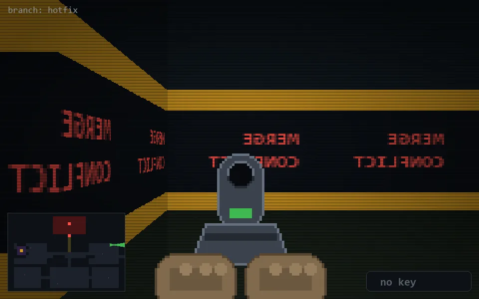

<!-- node:x34y10Ed -->
### `branch: hotfix` · 📍 (34, 10) · facing E · 🔑 — · ✖ bug deleted (it will be back)

|      |      |      |
|:----:|:----:|:----:|
|      | [⬆️](x35y10Ed.md) |      |
| [⬅️](x34y10Nd.md) | [💥](x34y10Ed.md) | [➡️](x34y10Sd.md) |
|      | [⬇️](x33y10Ed.md) |      |

[⌂ index](../README.md)
