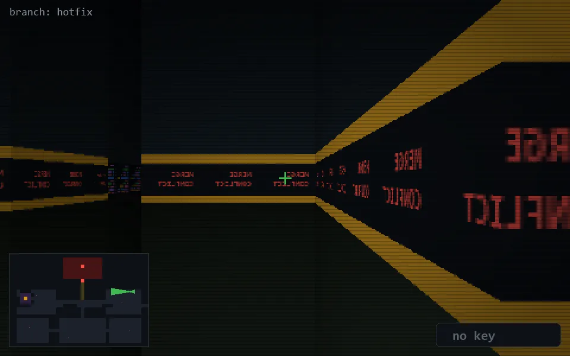

<!-- node:x34y10W -->
### `branch: hotfix` · 📍 (34, 10) · facing W · 🔑 —

|      |      |      |
|:----:|:----:|:----:|
|      | [⬆️](x33y10W.md) |      |
| [⬅️](x34y10S.md) | [💥](x34y10Wd.md) | [➡️](x34y10N.md) |
|      | [⬇️](x35y10W.md) |      |

[⌂ index](../README.md)
