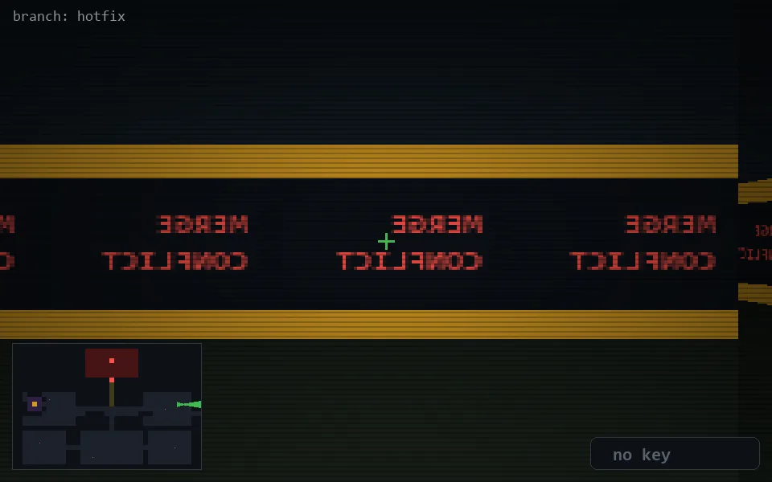

<!-- node:x34y12E -->
### `branch: hotfix` · 📍 (34, 12) · facing E · 🔑 —

|      |      |      |
|:----:|:----:|:----:|
|      | [⬆️](x35y12E.md) |      |
| [⬅️](x34y12N.md) | [💥](x34y12Ed.md) | [➡️](x34y12S.md) |
|      | [⬇️](x33y12E.md) |      |

[⌂ index](../README.md)
