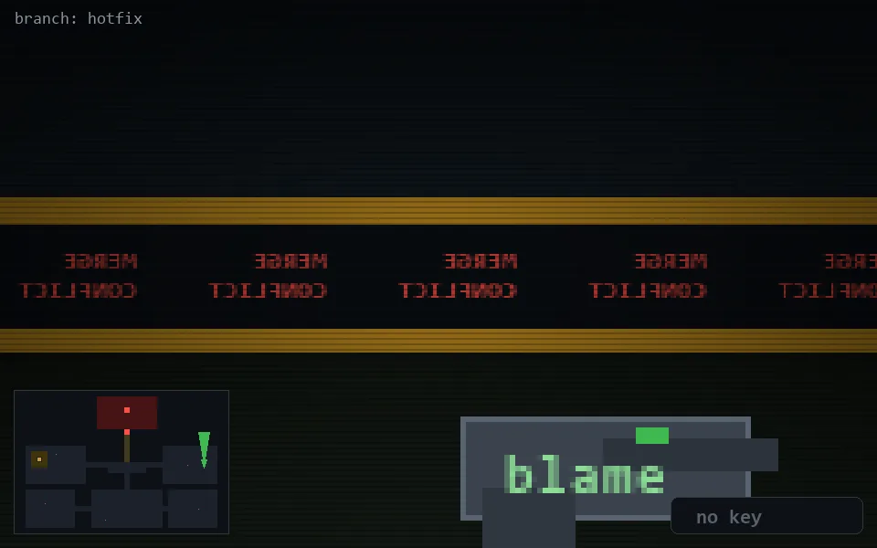

<!-- node:x34y13N -->
### `branch: hotfix` · 📍 (34, 13) · facing N · 🔑 —

|      |      |      |
|:----:|:----:|:----:|
|      | [⬆️](x34y12N.md) |      |
| [⬅️](x34y13W.md) | [💥](x34y13Nd.md) | [➡️](x34y13E.md) |
|      | [⬇️](x34y14N.md) |      |

[⌂ index](../README.md)
