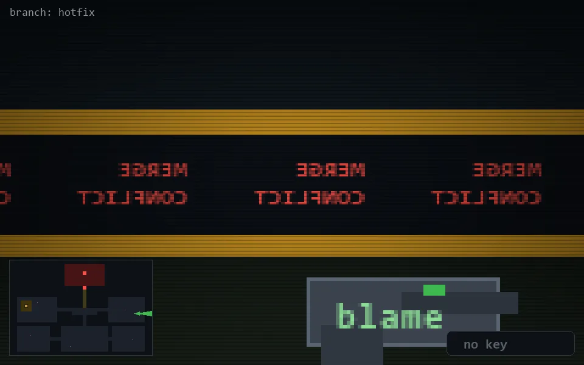

<!-- node:x34y14E -->
### `branch: hotfix` · 📍 (34, 14) · facing E · 🔑 —

|      |      |      |
|:----:|:----:|:----:|
|      | [⬆️](x35y14E.md) |      |
| [⬅️](x34y14N.md) | [💥](x34y14Ed.md) | [➡️](x34y14S.md) |
|      | [⬇️](x33y14E.md) |      |

[⌂ index](../README.md)
