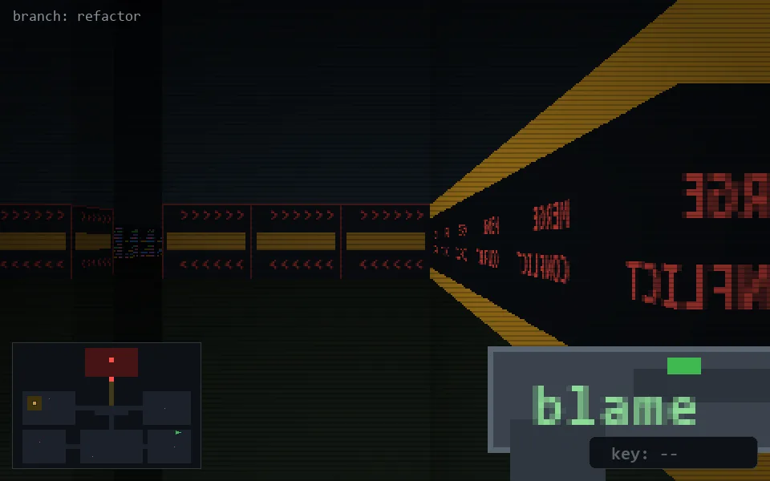

<!-- node:x34y18W -->
### `branch: refactor` · 📍 (34, 18) · facing W · 🔑 —

|      |      |      |
|:----:|:----:|:----:|
|      | [⬆️](x33y18W.md) |      |
| [⬅️](x34y18S.md) | [💥](x34y18W.md) | [➡️](x34y18N.md) |
|      | [⬇️](x35y18W.md) |      |

[⌂ index](../README.md)
