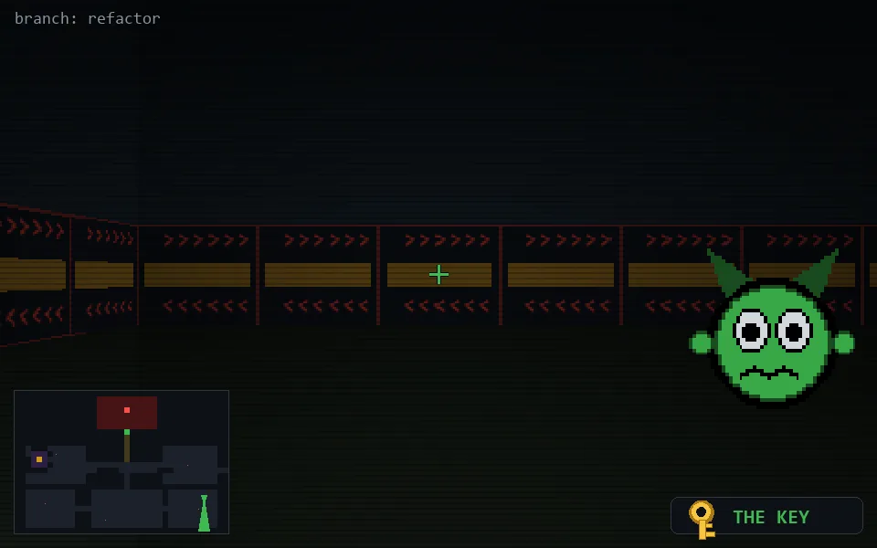

<!-- node:x34y19Sk -->
### `branch: refactor` · 📍 (34, 19) · facing S · 🔑 THE KEY

|      |      |      |
|:----:|:----:|:----:|
|      | [⬆️](x34y20Sk.md) |      |
| [⬅️](x34y19Ek.md) | [💥](x34y19Sk.md) | [➡️](x34y19Wk.md) |
|      | [⬇️](x34y18Sk.md) |      |

[⌂ index](../README.md)
