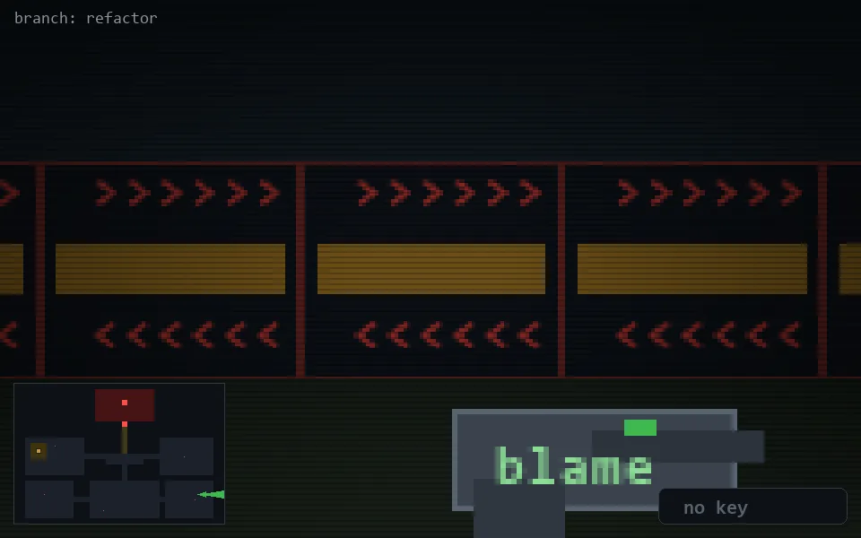

<!-- node:x34y20E -->
### `branch: refactor` · 📍 (34, 20) · facing E · 🔑 —

|      |      |      |
|:----:|:----:|:----:|
|      | [⬆️](x35y20E.md) |      |
| [⬅️](x34y20N.md) | [💥](x34y20E.md) | [➡️](x34y20S.md) |
|      | [⬇️](x33y20E.md) |      |

[⌂ index](../README.md)
