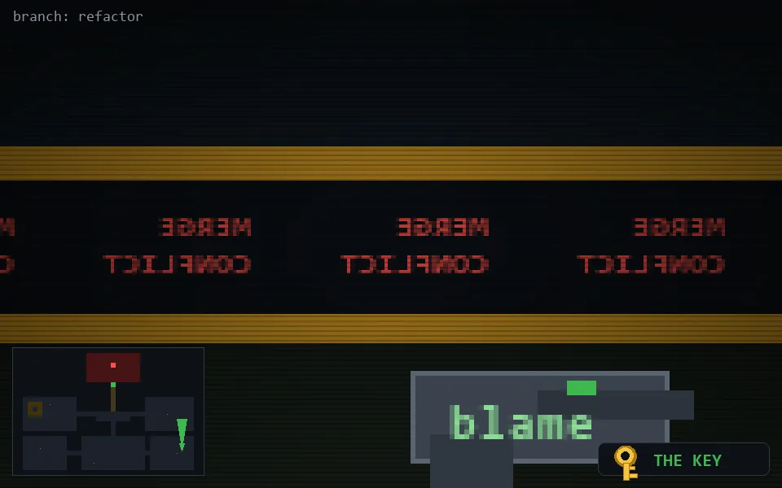

<!-- node:x34y20Nk -->
### `branch: refactor` · 📍 (34, 20) · facing N · 🔑 LGTM

|      |      |      |
|:----:|:----:|:----:|
|      | [⬆️](x34y19Nk.md) |      |
| [⬅️](x34y20Wk.md) | [💥](x34y20Nk.md) | [➡️](x34y20Ek.md) |
|      | [⬇️](x34y21Nk.md) |      |

[⌂ index](../README.md)
