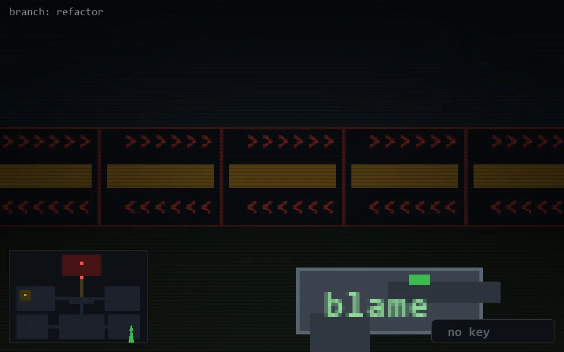

<!-- node:x34y21S -->
### `branch: refactor` · 📍 (34, 21) · facing S · 🔑 —

|      |      |      |
|:----:|:----:|:----:|
|      | ⛔️ |      |
| [⬅️](x34y21E.md) | [💥](x34y21S.md) | [➡️](x34y21W.md) |
|      | ⛔️ |      |

[⌂ index](../README.md)
