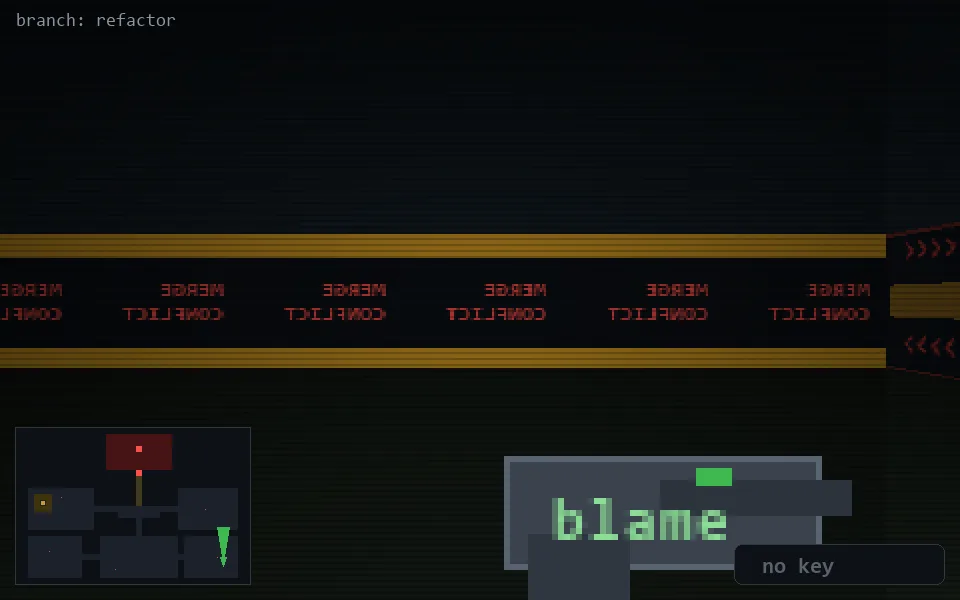

<!-- node:x34y22N -->
### `branch: refactor` · 📍 (34, 22) · facing N · 🔑 —

|      |      |      |
|:----:|:----:|:----:|
|      | [⬆️](x34y21N.md) |      |
| [⬅️](x34y22W.md) | [💥](x34y22Nd.md) | [➡️](x34y22E.md) |
|      | [⬇️](x34y23N.md) |      |

[⌂ index](../README.md)
