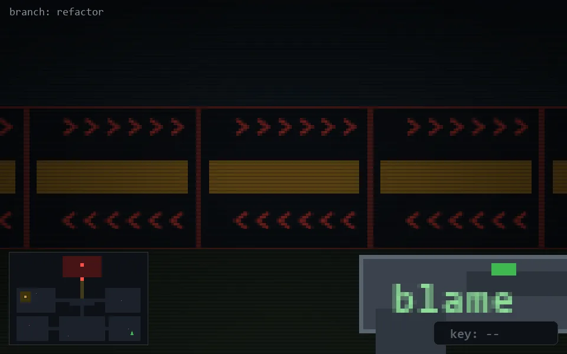

<!-- node:x34y22S -->
### `branch: refactor` · 📍 (34, 22) · facing S · 🔑 —

|      |      |      |
|:----:|:----:|:----:|
|      | [⬆️](x34y23S.md) |      |
| [⬅️](x34y22E.md) | [💥](x34y22Sd.md) | [➡️](x34y22W.md) |
|      | [⬇️](x34y21S.md) |      |

[⌂ index](../README.md)
