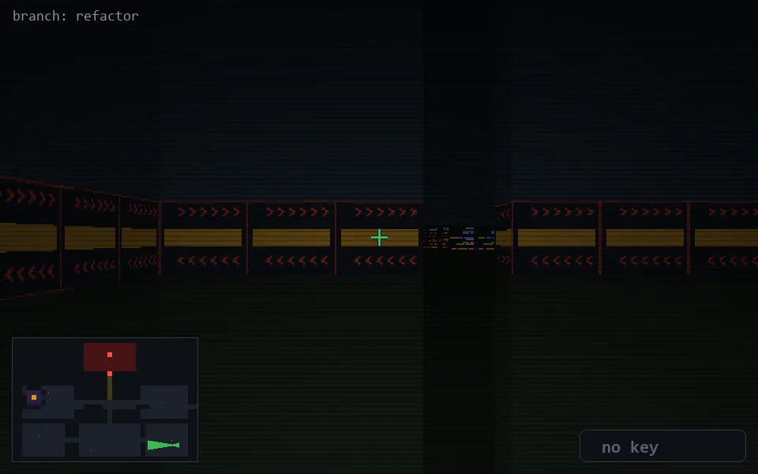

<!-- node:x34y22Wd -->
### `branch: refactor` · 📍 (34, 22) · facing W · 🔑 — · ✖ bug deleted (it will be back)

|      |      |      |
|:----:|:----:|:----:|
|      | [⬆️](x33y22Wd.md) |      |
| [⬅️](x34y22Sd.md) | [💥](x34y22Wd.md) | [➡️](x34y22Nd.md) |
|      | [⬇️](x35y22Wd.md) |      |

[⌂ index](../README.md)
