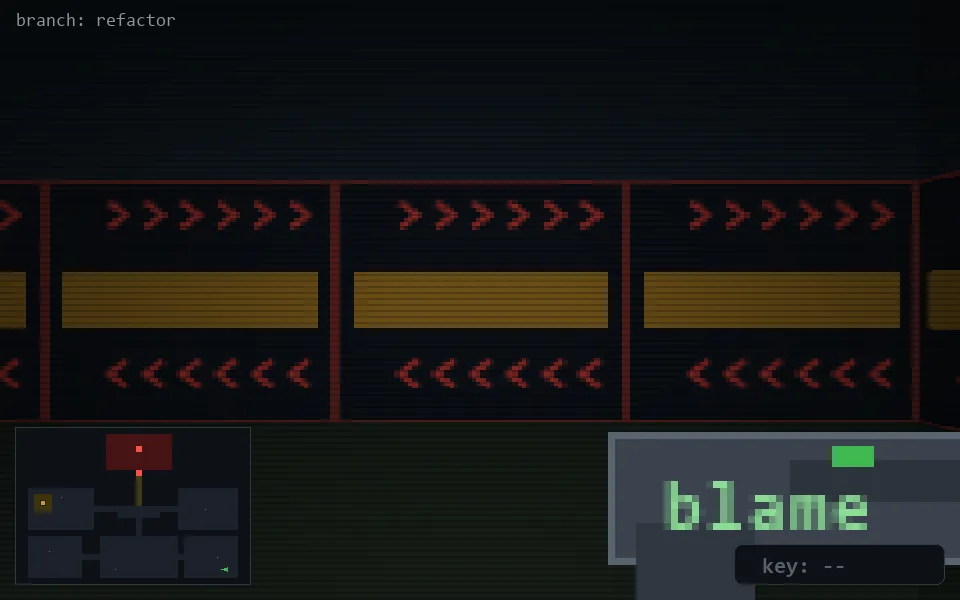

<!-- node:x34y23E -->
### `branch: refactor` · 📍 (34, 23) · facing E · 🔑 —

|      |      |      |
|:----:|:----:|:----:|
|      | [⬆️](x35y23E.md) |      |
| [⬅️](x34y23N.md) | [💥](x34y23E.md) | [➡️](x34y23S.md) |
|      | [⬇️](x33y23E.md) |      |

[⌂ index](../README.md)
