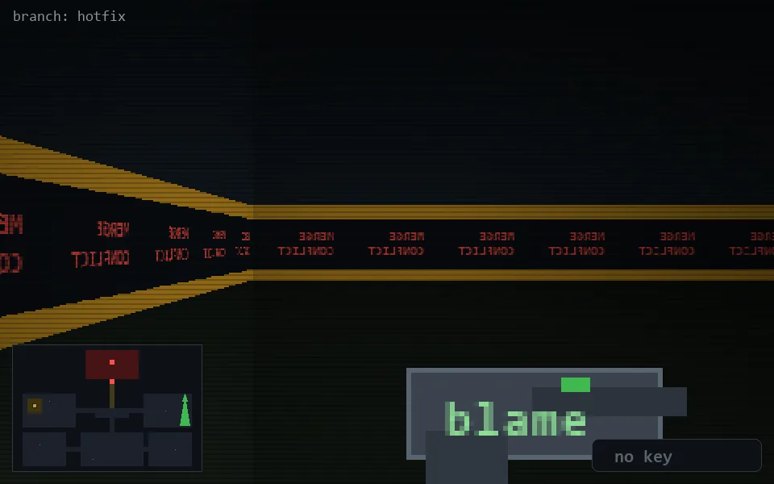

<!-- node:x35y10S -->
### `branch: hotfix` · 📍 (35, 10) · facing S · 🔑 —

|      |      |      |
|:----:|:----:|:----:|
|      | [⬆️](x35y11S.md) |      |
| [⬅️](x35y10E.md) | [💥](x35y10Sd.md) | [➡️](x35y10W.md) |
|      | ⛔️ |      |

[⌂ index](../README.md)
