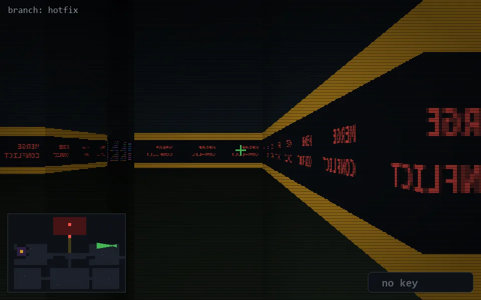

<!-- node:x35y10W -->
### `branch: hotfix` · 📍 (35, 10) · facing W · 🔑 —

|      |      |      |
|:----:|:----:|:----:|
|      | [⬆️](x34y10W.md) |      |
| [⬅️](x35y10S.md) | [💥](x35y10W.md) | [➡️](x35y10N.md) |
|      | [⬇️](x36y10W.md) |      |

[⌂ index](../README.md)
