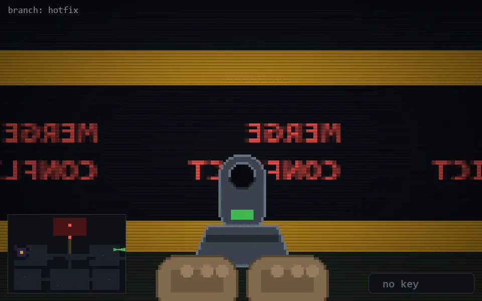

<!-- node:x35y11Ed -->
### `branch: hotfix` · 📍 (35, 11) · facing E · 🔑 — · ✖ bug deleted (it will be back)

|      |      |      |
|:----:|:----:|:----:|
|      | [⬆️](x36y11Ed.md) |      |
| [⬅️](x35y11Nd.md) | [💥](x35y11Ed.md) | [➡️](x35y11Sd.md) |
|      | [⬇️](x34y11Ed.md) |      |

[⌂ index](../README.md)
