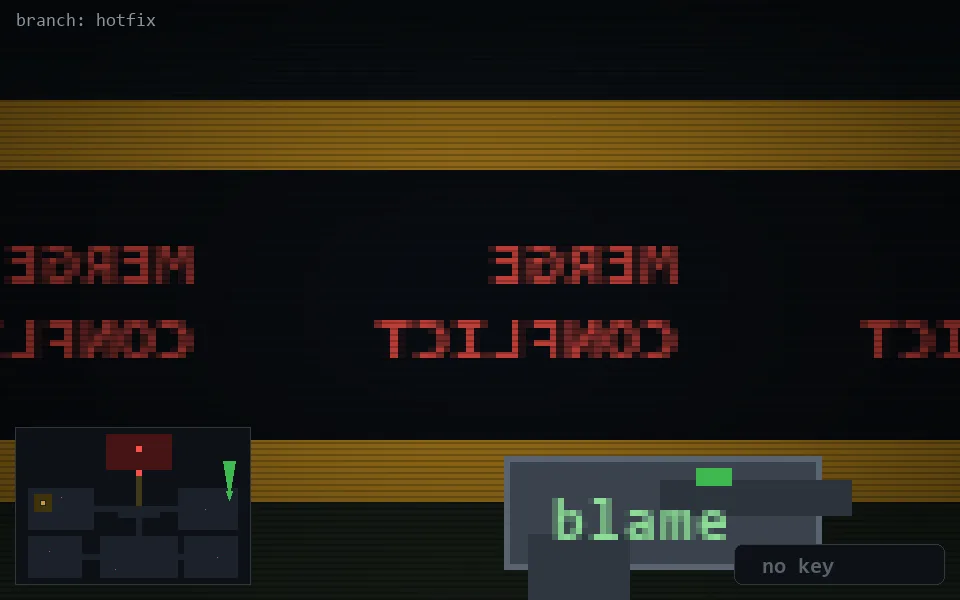

<!-- node:x35y11N -->
### `branch: hotfix` · 📍 (35, 11) · facing N · 🔑 —

|      |      |      |
|:----:|:----:|:----:|
|      | [⬆️](x35y10N.md) |      |
| [⬅️](x35y11W.md) | [💥](x35y11N.md) | [➡️](x35y11E.md) |
|      | [⬇️](x35y12N.md) |      |

[⌂ index](../README.md)
