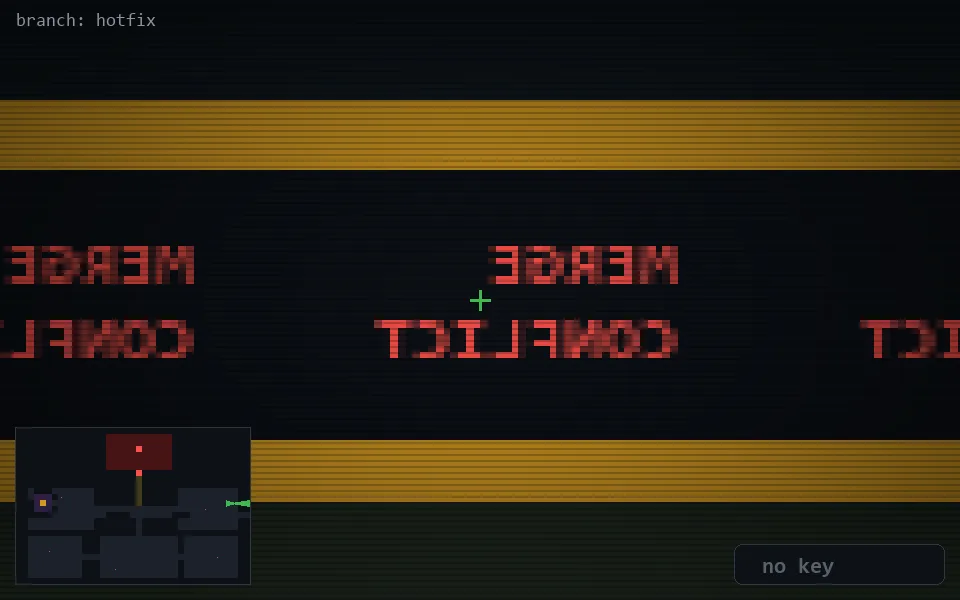

<!-- node:x35y12E -->
### `branch: hotfix` · 📍 (35, 12) · facing E · 🔑 —

|      |      |      |
|:----:|:----:|:----:|
|      | [⬆️](x36y12E.md) |      |
| [⬅️](x35y12N.md) | [💥](x35y12Ed.md) | [➡️](x35y12S.md) |
|      | [⬇️](x34y12E.md) |      |

[⌂ index](../README.md)
