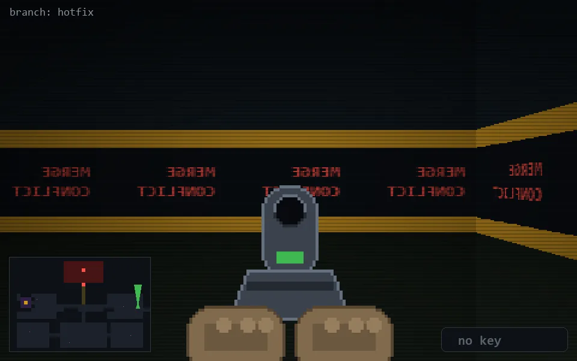

<!-- node:x35y13Nd -->
### `branch: hotfix` · 📍 (35, 13) · facing N · 🔑 — · ✖ bug deleted (it will be back)

|      |      |      |
|:----:|:----:|:----:|
|      | [⬆️](x35y12Nd.md) |      |
| [⬅️](x35y13Wd.md) | [💥](x35y13Nd.md) | [➡️](x35y13Ed.md) |
|      | [⬇️](x35y14Nd.md) |      |

[⌂ index](../README.md)
