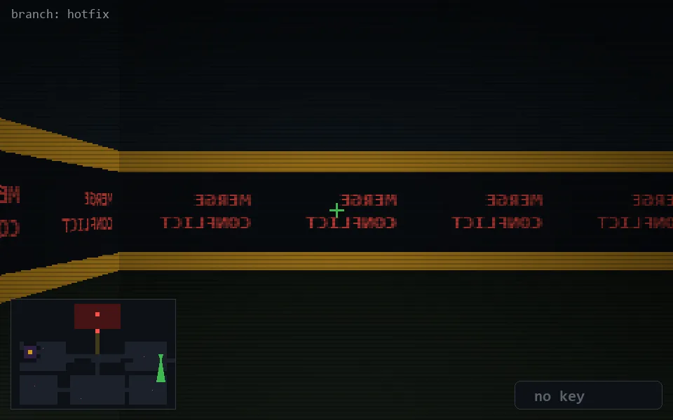

<!-- node:x35y13Sd -->
### `branch: hotfix` · 📍 (35, 13) · facing S · 🔑 — · ✖ bug deleted (it will be back)

|      |      |      |
|:----:|:----:|:----:|
|      | [⬆️](x35y14Sd.md) |      |
| [⬅️](x35y13Ed.md) | [💥](x35y13Sd.md) | [➡️](x35y13Wd.md) |
|      | [⬇️](x35y12Sd.md) |      |

[⌂ index](../README.md)
