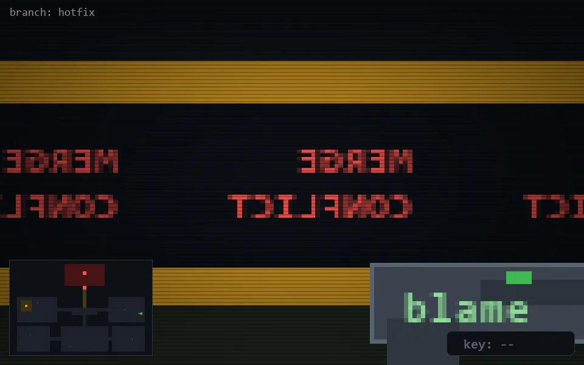

<!-- node:x35y14E -->
### `branch: hotfix` · 📍 (35, 14) · facing E · 🔑 —

|      |      |      |
|:----:|:----:|:----:|
|      | [⬆️](x36y14E.md) |      |
| [⬅️](x35y14N.md) | [💥](x35y14Ed.md) | [➡️](x35y14S.md) |
|      | [⬇️](x34y14E.md) |      |

[⌂ index](../README.md)
